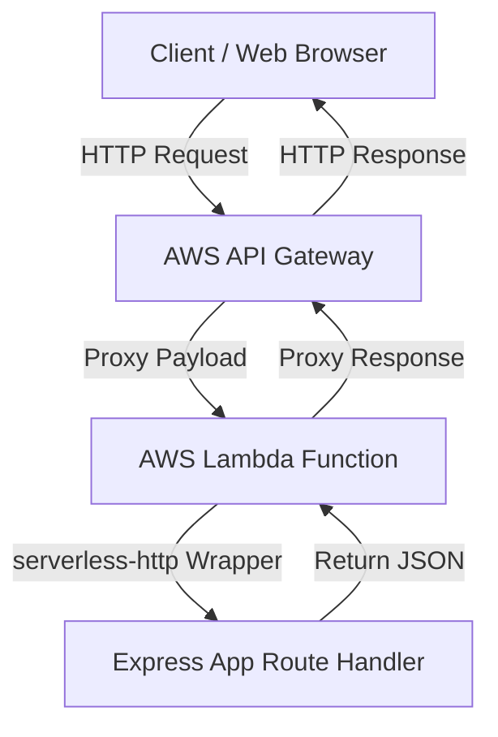

# Project Architecture

This project is configured as a Serverless Web API running on AWS Lambda, using Node.js, TypeScript, Express, and AWS SAM.

## Architecture Diagram

## Key Components

### 1. AWS SAM (`template.yaml`)
AWS Serverless Application Model (SAM) is used to define and deploy the serverless infrastructure.
- **Resource `ExpressApiFunction`**: A single Lambda function that acts as the entry point for all API requests.
- **API Event Integration**: Configured with a wild card proxy route (`/{proxy+}`) and root route (`/`) to route all incoming HTTP methods (`GET`, `POST`, etc.) and paths to the Lambda handler.
- **Esbuild Builder**: AWS SAM natively compiles and packages TypeScript files using `esbuild` according to metadata configurations.

### 2. Express Framework (`src/app.ts`)
We use Express.js for simple and standard routing and middleware handling. This makes the local development process identical to developing a traditional Node.js API, and makes it easy to migrate standard Express applications to AWS Lambda.

### 3. Serverless HTTP Adapter (`src/handlers/api.ts`)
The `serverless-http` package converts the Lambda event and context objects passed by API Gateway into request and response objects that Express can understand, wrapping the application seamlessly.
